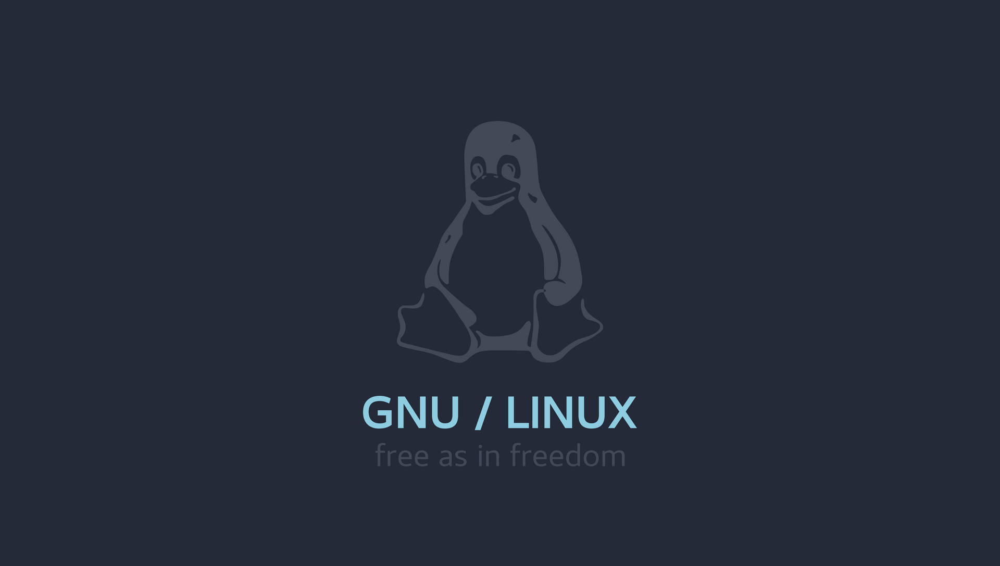

# Linux setup

- If you dont want to use `i3 manager` some tools in this project are useless to you, pay attention

## Requirements

```
sudo yay -S ttf-meslo-nerd picom stow polybar feh rofi maim xclip nvim alacritty 
```

- All this direectories its supossed to be allocated on `~/.config/`. 

You can use stow, to do that: 

```
stow alacritty
```

This command will create a copy on correct path

---

### TMUX config & TPM

**Warning**, `tmux.conf` needs to be on root of linux, not in `~/.config`;

After that, you can launch: 

```
tmux source ~/.tmux.conf && nvim ~/.tmux.conf
```

To install TPM packages, just type `leader+I`

--- 

## Why I use this tools ?

- **picom**: A lightweight compositor for X11, adding effects like transparency, shadows, and animations.
- **stow**: A symlink manager to manage dotfiles by creating symbolic links in the home directory.
- **polybar**: A fast and easy-to-use status bar for displaying system information and custom scripts.
- **feh**: A lightweight image viewer used for setting desktop backgrounds.
- **rofi**: A window switcher, application launcher, and dmenu replacement with customizable themes.
- **maim**: A utility to take screenshots with various options.
- **xclip**: A command line interface to the X11 clipboard, useful for copying and pasting.
- **nvim**: A modernized version of Vim, an advanced text editor for efficient coding and text manipulation.

---

### i3 shortcuts


| Shortcut | Description |
|----------|-------------|
| `$mod+Shift+s` | Take a screenshot of a selected area and copy it to the clipboard. |
| `$mod+space` | Launch Rofi in combi mode (combined application launcher, window switcher, etc.). |
| `$mod+d` | Launch Dmenu, a simple application launcher. |
| `$mod+0` | Execute a shell script to powerOff, restart, suspend and another actions... |
| `$mod+Return` | Launch Alacritty terminal. |
| `$mod+Shift+q` | Kill the focused window. |
| `$mod+j` | Focus the window to the left. |
| `$mod+k` | Focus the window below. |
| `$mod+l` | Focus the window above. |
| `$mod+semicolon` | Focus the window to the right. |
| `$mod+Left` | Focus the window to the left (using arrow key). |
| `$mod+Down` | Focus the window below (using arrow key). |
| `$mod+Up` | Focus the window above (using arrow key). |
| `$mod+Right` | Focus the window to the right (using arrow key). |
| `$mod+Shift+j` | Move the focused window to the left. |
| `$mod+Shift+k` | Move the focused window down. |
| `$mod+Shift+l` | Move the focused window up. |
| `$mod+Shift+semicolon` | Move the focused window to the right. |
| `$mod+Shift+Left` | Move the focused window to the left (using arrow key). |
| `$mod+Shift+Down` | Move the focused window down (using arrow key). |
| `$mod+Shift+Up` | Move the focused window up (using arrow key). |
| `$mod+Shift+Right` | Move the focused window to the right (using arrow key). |
| `$mod+h` | Split the focused container into horizontal orientation. |
| `$mod+v` | Split the focused container into vertical orientation. |
| `$mod+f` | Toggle fullscreen mode for the focused container. |
| `$mod+s` | Change container layout to stacking. |
| `$mod+w` | Change container layout to tabbed. |
| `$mod+e` | Toggle split layout for the focused container. |
| `$mod+Shift+space` | Toggle tiling/floating mode for the focused window. |
| `$mod+a` | Focus the parent container. |
| `$mod+1` | Switch to workspace 1. |
| `$mod+2` | Switch to workspace 2. |
| `$mod+3` | Switch to workspace 3. |
| `$mod+4` | Switch to workspace 4. |
| `$mod+5` | Switch to workspace 5. |
| `$mod+6` | Switch to workspace 6. |
| `$mod+7` | Switch to workspace 7. |
| `$mod+8` | Switch to workspace 8. |
| `$mod+9` | Switch to workspace 9. |
| `$mod+Shift+1` | Move the focused container to workspace 1. |
| `$mod+Shift+2` | Move the focused container to workspace 2. |
| `$mod+Shift+3` | Move the focused container to workspace 3. |
| `$mod+Shift+4` | Move the focused container to workspace 4. |
| `$mod+Shift+5` | Move the focused container to workspace 5. |
| `$mod+Shift+6` | Move the focused container to workspace 6. |
| `$mod+Shift+7` | Move the focused container to workspace 7. |
| `$mod+Shift+8` | Move the focused container to workspace 8. |
| `$mod+Shift+9` | Move the focused container to workspace 9. |
| `$mod+Shift+c` | Reload the i3 configuration file. |
| `$mod+Shift+r` | Restart i3 inplace (preserves your layout/session). |
| `$mod+Shift+e` | Exit i3 and end the X session. |
| `$mod+r` | Enter resize mode for resizing windows. |
